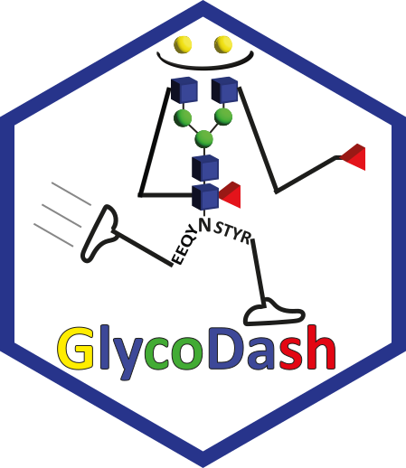
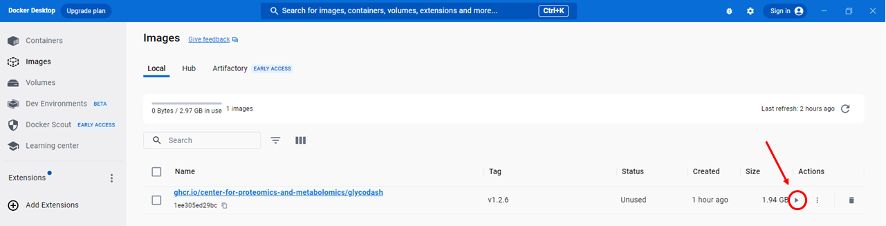
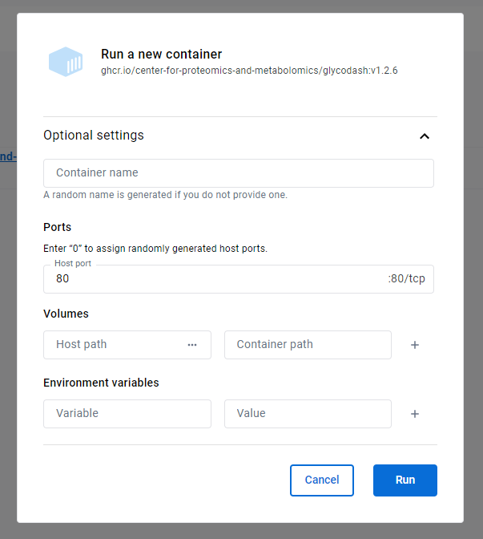
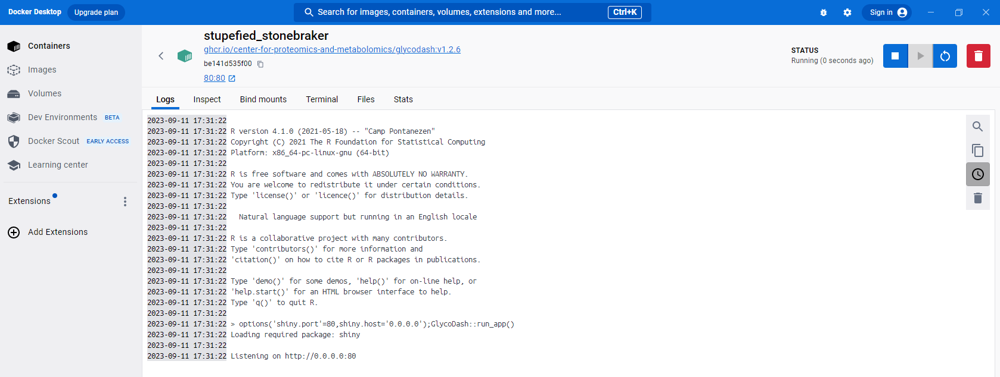
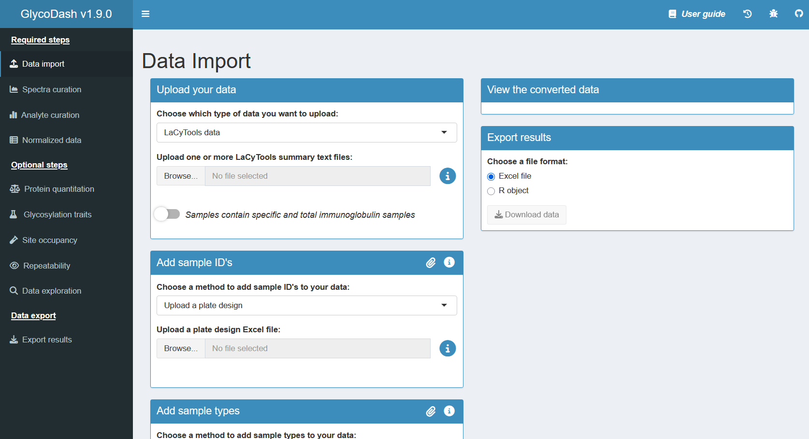

# GlycoDash </a>

GlycoDash is an R Shiny dashboard for processing glycomics data obtained from [LaCyTools](<https://pubs.acs.org/doi/10.1021/acs.jproteome.6b00171>), 
[SweetSuite](https://github.com/stainawarijar/SweetSuite) and [Skyline](<https://skyline.ms>).

## Publication
GlycoDash was originally described in:

Pongracz, T., Gijze, S., Hipgrave Ederveen, A. et al. (2025). *GlycoDash: automated, visually assisted curation of glycoproteomics datasets for large sample numbers*. **Analytical and Bioanalytical Chemistry**.  
https://doi.org/10.1007/s00216-025-05794-3

Since publication, GlycoDash has undergone continued development and refinement. The current version includes additional features and improvements that extend beyond the scope of the published manuscript.

## Installation

### Option 1: Run GlycoDash using Docker (recommended)
_Note: it is recommended that you have at least 16 GB of RAM._
1. Download and install [Docker desktop](https://www.docker.com/products/docker-desktop/) on your computer.
2. Start Docker desktop on your computer.
3. Open a terminal (in Windows, this is called "cmd" or "Command Prompt").
4. Get the most recent GlycoDash package [here](https://github.com/Center-for-Proteomics-and-Metabolomics/GlycoDash/pkgs/container/glycodash).

   Then pull the Docker image by pasting the listed command in your terminal.
   
   Docker will now build an image which can take some time.
6. The image should now be loaded in Docker. Click the Run button. Then click optional settings, and for "host port" fill in 80. Then click "Run".

<p align="center";">
    \
    
</p>
<br />

7. Under the "Containers" tab in Docker, you should now see something like this:
   
<p align="center";">
    
</p>
<br />

8. To use the dashboard: open your browser, type "localhost" in the search bar and hit enter. You should now be able to use the dashboard:

<p align="center";">
    
</p>
<br />


9. When you are done using GlycoDash, simply stop the container in Docker by clicking the stop button. 

10. To close Docker entirely in Windows, right-click the Docker icon in the bottom-right corner of your taskbar, and then click "Quit Docker Desktop". Afterwards, you may want to run the command `wsl --shutdown` in your Command Prompt to free up memory.


### Option 2: Run GlycoDash in RStudio
_This method uses a reproducible R environment managed by renv._

1.  Install [R version 4.5.0](https://cran.r-project.org/bin/windows/base/old/) and [Rstudio](https://posit.co/download/rstudio-desktop/) on your computer.
    (R 4.5.0 can be installed alongside other R versions).
2.  Install [RTools 4.5](https://cran.r-project.org/bin/windows/Rtools/rtools45/rtools.html) using the official _Rtools45_ installer and keep the default settings.
    This is required to build some packages from source.
3.  Configure RStudio to use R 4.5.0 (`Tools → Global Options → General → R version → Change…`). Apply the changes and close RStudio.
4.  Download the source code of the `master` branch as a zip file, then unzip and store the "glycodash-master" folder somewhere.
5.  Double click “glycodash.Rproj”, this will open the project in RStudio. You will see a message indicating that the `renv` package was installed.
6.  In the R console, run `renv::restore()`. This will download and install all required R packages exactly as specified for this project.\
   ⏳ *This may take several minutes.*

8.  In RStudio, open the file `dev/run_dev.R`.
9.  With `dev/run_dev.R` open, press `Ctrl+Shift+Enter` to run the dashboard.\
    If prompted to install the **roxygen2** package, confirm the installation.
10. After these steps, the GlycoDash Shiny application should start automatically in your RStudio session.\
    Optionally, you can click `Open in browser` (this should look better).

## How to use GlycoDash
In the top-right corner of GlycoDash, click on the book icon to download a manual for the version you are using.
Or [click here](https://github.com/Center-for-Proteomics-and-Metabolomics/GlycoDash/blob/master/inst/app/www/GlycoDash_manual.pdf) for the manual of the latest release.


## Branches

The ```master``` branch will be used for “official” releases.

The ```alfa``` branch is the development branch.

The ```beta``` branch contains the version of the dashboard that is currently
running on the cpmtools server within the LUMC.
