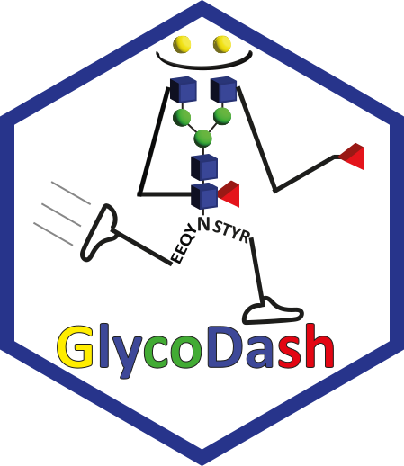

# GlycoDash </a>

[![bio.tools](https://img.shields.io/badge/bio.tools-GlycoDash-blue.svg?labelColor=gray&logo=)](https://bio.tools/GlycoDash)
[![Bridge](https://img.shields.io/badge/bridge-bio.tools%20%E2%86%92%20github-blue.svg?labelColor=orange&logo=)](https://bio-tools.github.io/biohackathon2025/)

GlycoDash is an R Shiny dashboard for processing glycomics data obtained from [LaCyTools](<https://pubs.acs.org/doi/10.1021/acs.jproteome.6b00171>), 
[SweetSuite](https://github.com/stainawarijar/SweetSuite) and [Skyline](<https://skyline.ms>).

## Publication
GlycoDash was originally described in:

Pongracz, T., Gijze, S., Hipgrave Ederveen, A. et al. (2025). *GlycoDash: automated, visually assisted curation of glycoproteomics datasets for large sample numbers*. **Analytical and Bioanalytical Chemistry**.  
https://doi.org/10.1007/s00216-025-05794-3

Since publication, GlycoDash has undergone continued development and refinement. The current version includes additional features and improvements that extend beyond the scope of the published manuscript.

## Installation

### Option 1: Run GlycoDash using Docker (recommended)
_Note: it is recommended that you have at least 16 GB of RAM._
1. Download and install [Docker desktop](https://www.docker.com/products/docker-desktop/) on your computer.
2. Start Docker desktop on your computer.
3. Open a terminal (in Windows, this is called "cmd" or "Command Prompt").
4. To use the latest release version, paste the following command:
`docker pull ghcr.io/center-for-proteomics-and-metabolomics/glycodash:latest`
Docker will pull the image, which can take some time.
    - Alternatively, you can use the `beta` version of GlycoDash to use the
    newest features. Note that this version may be less stable.
    Download the code of the [beta branch](https://github.com/Center-for-Proteomics-and-Metabolomics/GlycoDash/tree/beta) as a zip file, and extract the folder somewhere. Open a terminal inside the folder, and run the following: `docker build . -t glycodash`

5. The image should now be loaded in Docker. Run GlycoDash locally using:
`docker run --rm -p 127.0.0.1:8080:80 ghcr.io/center-for-proteomics-and-metabolomics/glycodash:latest`
	- If instead you created an image for `beta` branch as described above, use `docker run --rm -p 127.0.0.1:8080:80 glycodash`

6. Open the dashboard in your internet browser, by navigating to `http://localhost:8080`
   
7. To stop the Docker container, navigate to the `Containers` tab in Docker Desktop, and click the "Stop" button (square).

8. To close Docker entirely in Windows, right-click the Docker icon in the bottom-right corner of your taskbar, and then click "Quit Docker Desktop". Afterwards, you may want to run the command `wsl --shutdown` in your terminal to free up memory.


### Option 2: Run GlycoDash in RStudio
_This method uses a reproducible R environment managed by renv._

1.  Install [R version 4.5.3](https://cran.r-project.org/bin/windows/base/old/) and [Rstudio](https://posit.co/download/rstudio-desktop/) on your computer.
    (R 4.5.3 can be installed alongside other R versions).
2.  Install [Rtools 4.5](https://cran.r-project.org/bin/windows/Rtools/rtools45/rtools.html) using the official _Rtools45_ installer and keep the default settings.
    This is required to build some packages from source.
3.  Configure RStudio to use R 4.5.3 (`Tools → Global Options → General → R version → Change…`). Apply the changes and close RStudio.
4.  Download the source code of the `master` branch as a zip file, then unzip and store the "glycodash-master" folder somewhere.
5.  Double click `glycodash.Rproj`, this will open the project in RStudio. You will see a message indicating that the `renv` package was installed.
6.  In the R console, run `renv::restore()`. This will download and install all required R packages exactly as specified for this project.\
   ⏳ *This may take several minutes.*

8.  In RStudio, open the file `dev/run_dev.R`.
9.  With `dev/run_dev.R` open, press `Ctrl+Shift+Enter` to run the dashboard.\
    If prompted to install extra packages, confirm the installation.
10. After these steps, the GlycoDash Shiny application should start automatically in your RStudio session.\
    Optionally, you can click `Open in browser` (this should look better).

## How to use GlycoDash
When running GlycoDash in Docker, click the book icon in the rop-right corner to download a user manual in PDF format.
Alternatively, download the manual for the latest release [here](https://github.com/Center-for-Proteomics-and-Metabolomics/GlycoDash/releases).


## Branches

The ```master``` branch will be used for “official” releases.

The ```alfa``` branch is the development branch.

The ```beta``` branch contains an experimental version of GlycoDash containing
the newest features. This version may be unstable.
