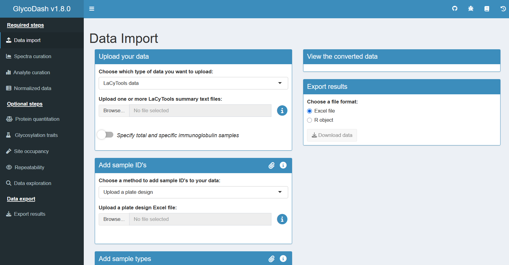

# GlycoDash </a>

GlycoDash is an R Shiny dashboard for processing glycomics data obtained from [LaCyTools](<https://pubs.acs.org/doi/10.1021/acs.jproteome.6b00171>) or [Skyline](<https://skyline.ms>).

## Installation

### Option 1: Run GlycoDash using Docker (recommended)
_Note: it is recommended that you have at least 16 GB of RAM._
1. Download and install [Docker desktop](https://www.docker.com/products/docker-desktop/) on your computer.
2. Start Docker desktop on your computer.
3. Open a terminal (in Windows, this is called "cmd" or "Command Prompt").
4. Get the most recent GlycoDash package [here](https://github.com/Center-for-Proteomics-and-Metabolomics/GlycoDash/pkgs/container/glycodash).

   Then pull the Docker image by pasting the listed command in your terminal.
   
   Docker will now build an image which can take some time.
6. The image should now be loaded in Docker. Click the Run button. Then click optional settings, and for "host port" fill in 80. Then click "Run".

<p align="center";">
    \
    
</p>
<br />

7. Under the "Containers" tab in Docker, you should now see something like this:
   
<p align="center";">
    
</p>
<br />

8. To use the dashboard: open your browser, type "localhost" in the search bar and hit enter. You should now be able to use the dashboard:

<p align="center";">
    
</p>
<br />


9. When you are done using GlycoDash, simply stop the container in Docker by clicking the stop button. 

10. To close Docker entirely in Windows, right-click the Docker icon in the bottom-right corner of your taskbar, and then click "Quit Docker Desktop". Afterwards, you may want to run the command `wsl --shutdown` in your Command Prompt to free up memory.


### Option 2: Run the GlycoDash code in RStudio.

1.  Install R and Rstudio: <https://posit.co/download/rstudio-desktop/>
2.  Download the source code of the `master` branch as a zip file, then unzip and store the "glycodash-master" folder somewhere.
3.  Double click “glycodash.Rproj”, this will launch RStudio.
4.  In Rstudio: click "file", "open". Then in the "glycodash-master"
    folder, open “run_dev.R” in the "dev" folder.
5.  In Rstudio, click the “source” button, or use Ctrl+Shift+S, to start
    the Dashboard. A new Rstudio window should now open with the
    dashboard running. *(Rstudio might first ask you to install required
    packages. Accept this. For package version requirements: see the DESCRIPTION
    file. See the Dockerfile for the package versions that were used in development.*)
7.  Optional: in the Rstudio dashboard window, click “open in browser”
    (this should look better). 

## How to use GlycoDash
In the top-right corner of GlycoDash, click on the book icon to download a manual for the version you are using.
Or [click here](https://github.com/Center-for-Proteomics-and-Metabolomics/GlycoDash/tree/master/man/documents/GlycoDash_manual.pdf) for the manual of the latest release.


## Branches

The ```master``` branch will be used for “official” releases.

The ```alfa``` branch is the development branch.

The ```beta``` branch contains the version of the dashboard that is currently
running on the cpmtools server within the LUMC.
